# FabVibe E-Commerce Platform

A fully functional Django-based e-commerce platform for selling clothing online.

## 🚀 Quick Start

```bash
# Install dependencies
pip install -r requirements.txt

# Run migrations
python manage.py migrate

# Load sample data
python manage.py populate_sample_data
python load_sample_data.py

# Run development server
python manage.py runserver
```

**Access the platform:**
- Frontend: http://localhost:8000/
- Admin: http://localhost:8000/admin/ (admin/admin123)

---

## 📊 Platform Overview

- **80 Products** across 4 main categories
- **16 Subcategories** with 5 products each
- **Complete e-commerce functionality** from browsing to checkout
- **Admin dashboard** for business management

---

## 🏗️ Category Structure

```
├── Accessories (20 products)
│   ├── Bags, Belts, Sunglasses, Watches
├── Kids (15 products)
│   ├── Boys, Girls, Infants
├── Men (25 products)
│   ├── Jackets, Jeans, Shirts, Shoes, T-Shirts
└── Women (20 products)
    ├── Dresses, Heels, Skirts, Tops
```

---

## ✨ Features

### Customer Features
✅ User registration & authentication  
✅ Product browsing & search  
✅ Shopping cart & wishlist  
✅ Checkout with multiple payment methods  
✅ Order tracking & history  
✅ Returns & exchanges  
✅ Invoice generation  

### Admin Features
✅ Dashboard with metrics  
✅ Product & category management  
✅ Order management  
✅ Inventory tracking  
✅ User management  
✅ Banner management  

---

## 🛠️ Utility Scripts

```bash
# List all categories
python list_categories.py

# List all users
python list_users.py

# List all products
python list_all_products.py

# Upload product images
python upload_image.py <source> <destination> --type product

# Reset users to default
python setup_users.py

# Backup database
python manage.py backup_db
```

---

## 📚 Documentation

- **[CATEGORIES_LIST.md](CATEGORIES_LIST.md)** - Complete category hierarchy
- **[UTILITY_SCRIPTS.md](UTILITY_SCRIPTS.md)** - Script usage guide
- **[PROJECT_SUMMARY.md](PROJECT_SUMMARY.md)** - Detailed project overview
- **[requirements.md](.kiro/specs/fabvibe-ecommerce-platform/requirements.md)** - Full requirements
- **[tasks.md](.kiro/specs/fabvibe-ecommerce-platform/tasks.md)** - Implementation tasks

---
---

## 📸 Screenshots

### Login Page

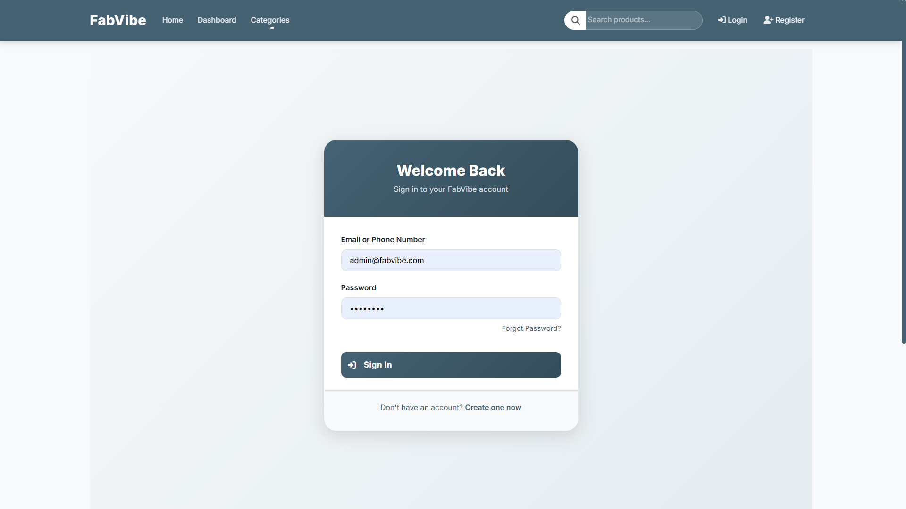

### Register Page

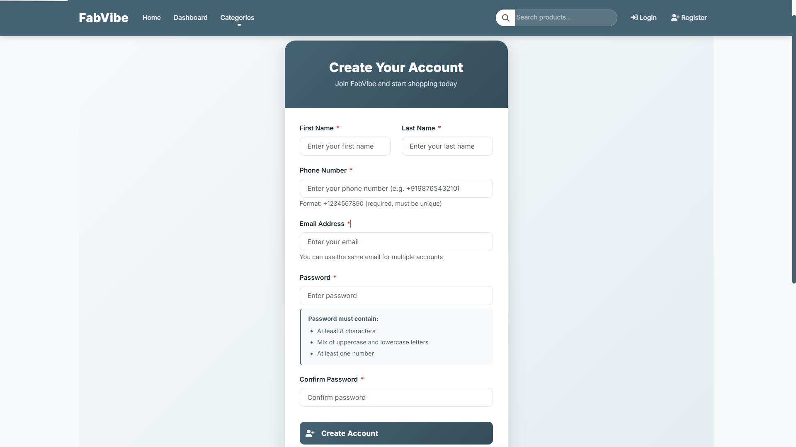

### home Page

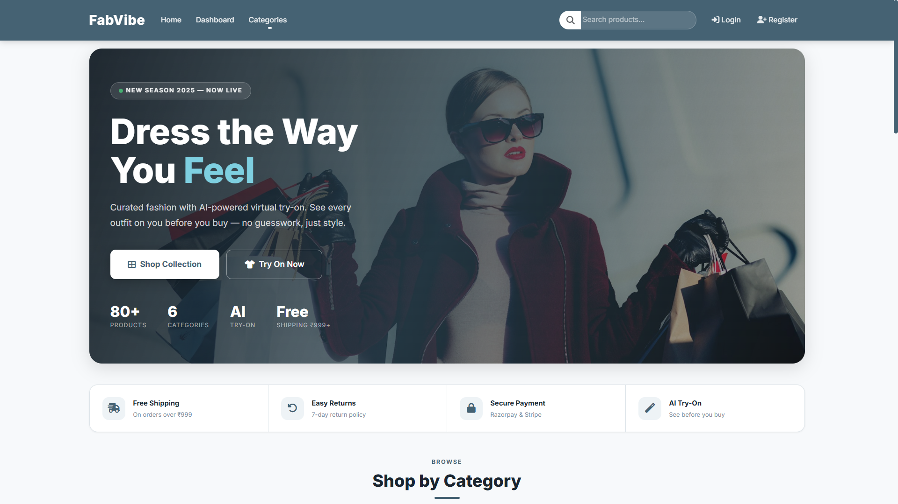

### dashboard Page

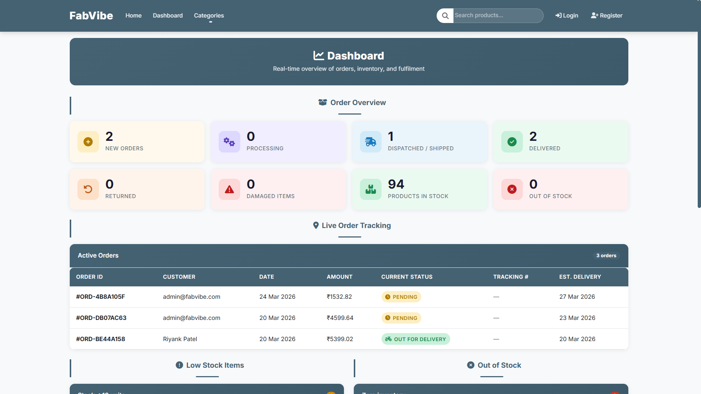

### category sunglass Page

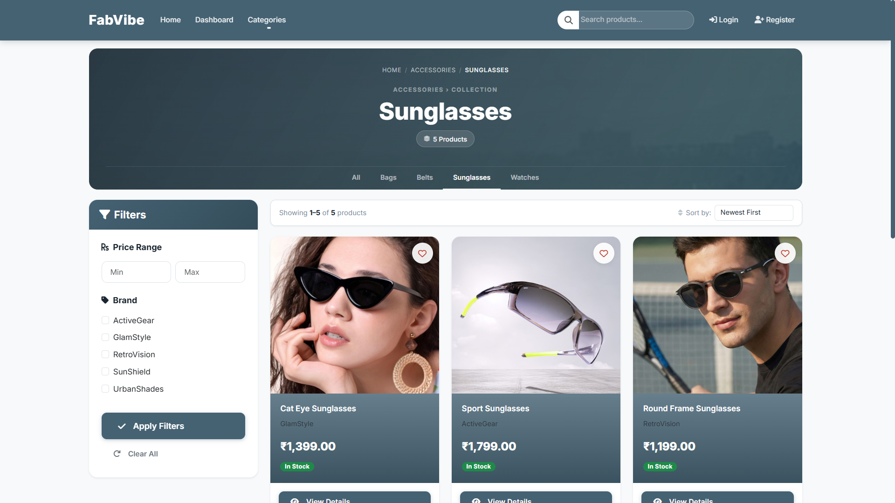

### category Page

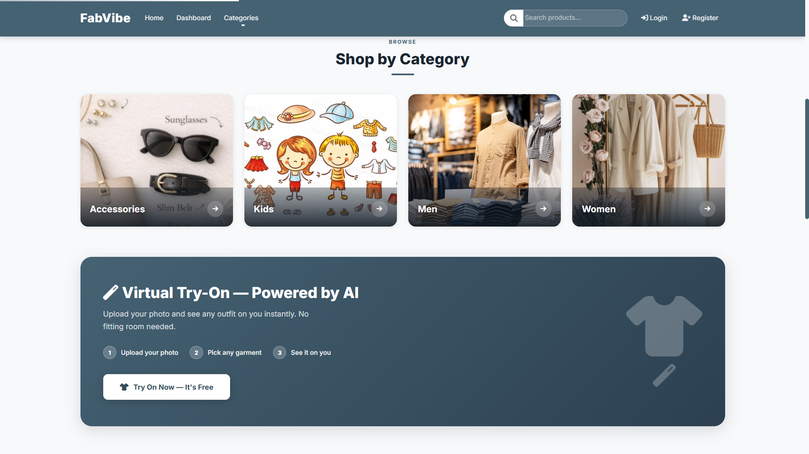

### feature Virtual-Tryon Page

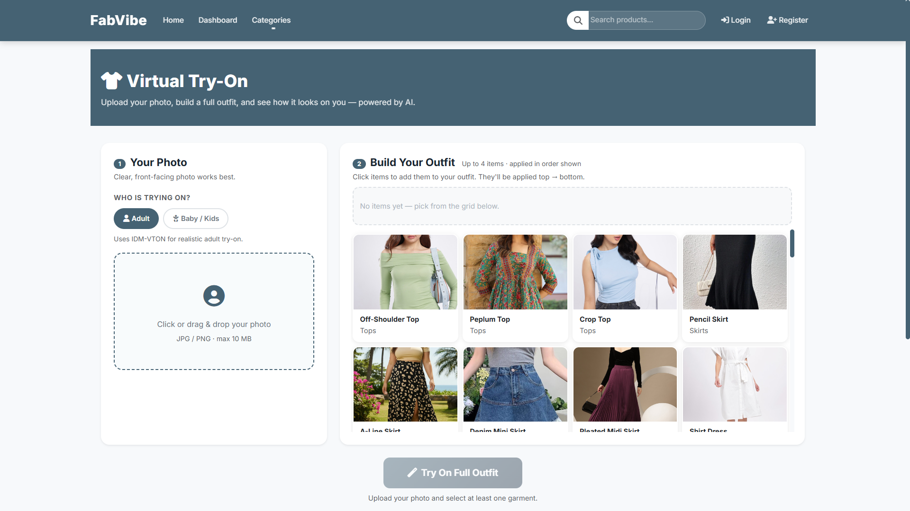

### Order_management Page

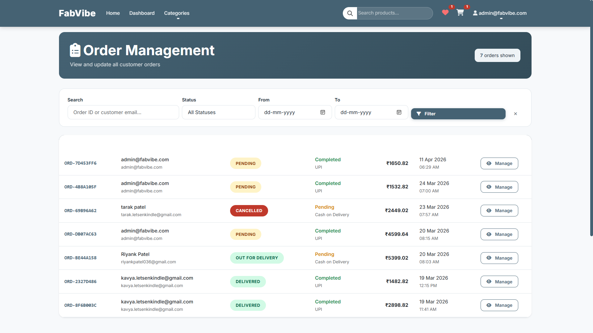

### Payment Page

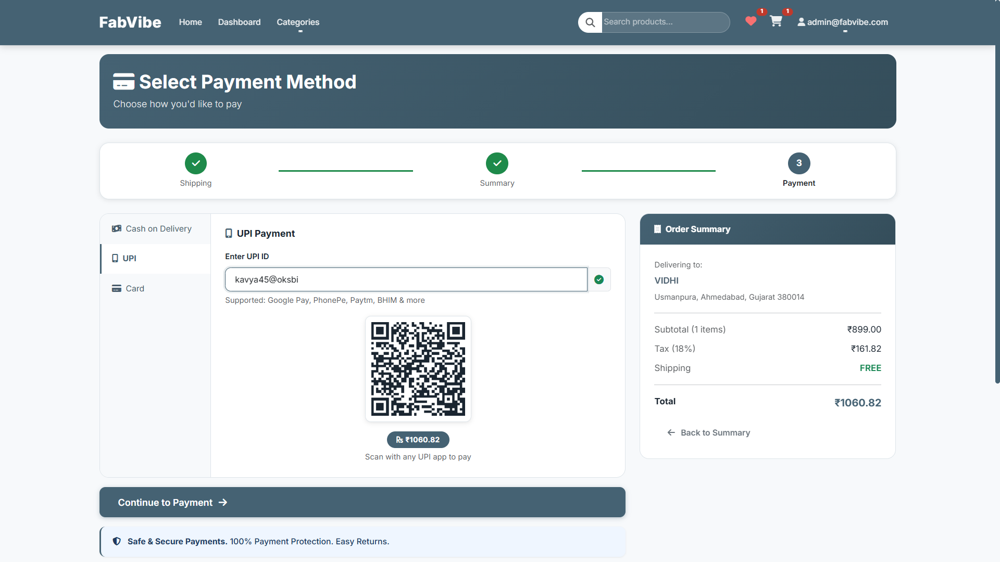

### Product Page

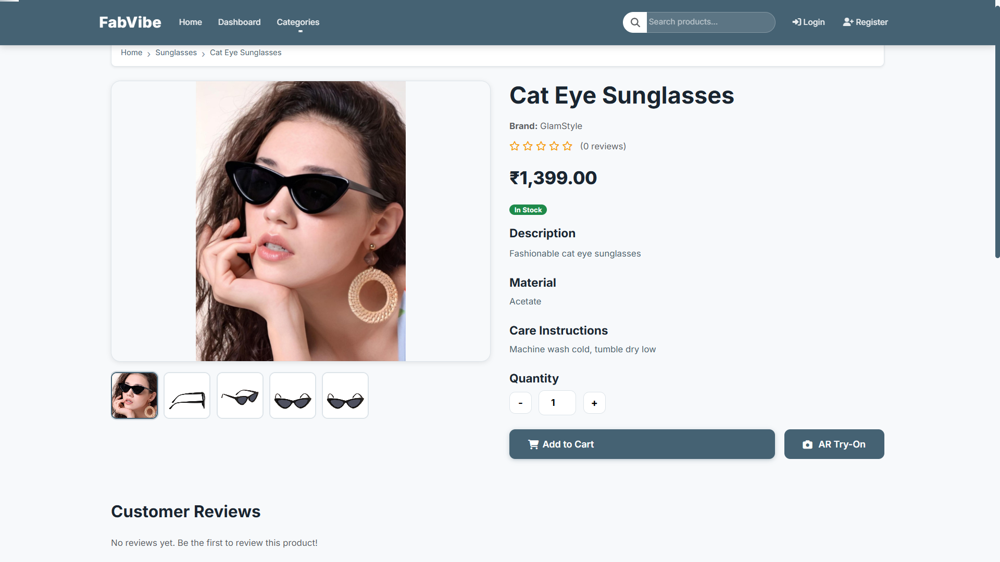

### shipping Page

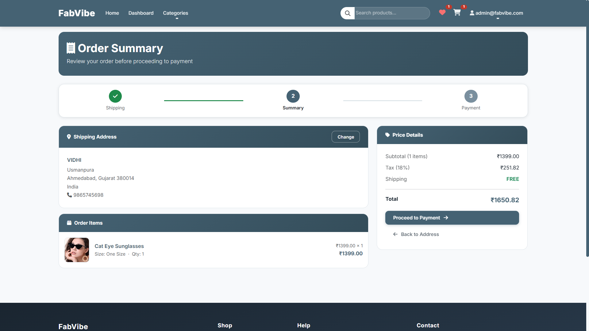

### stock Page

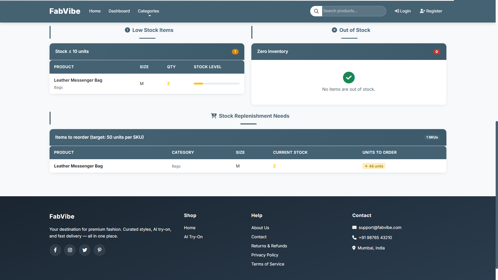

### update location Page

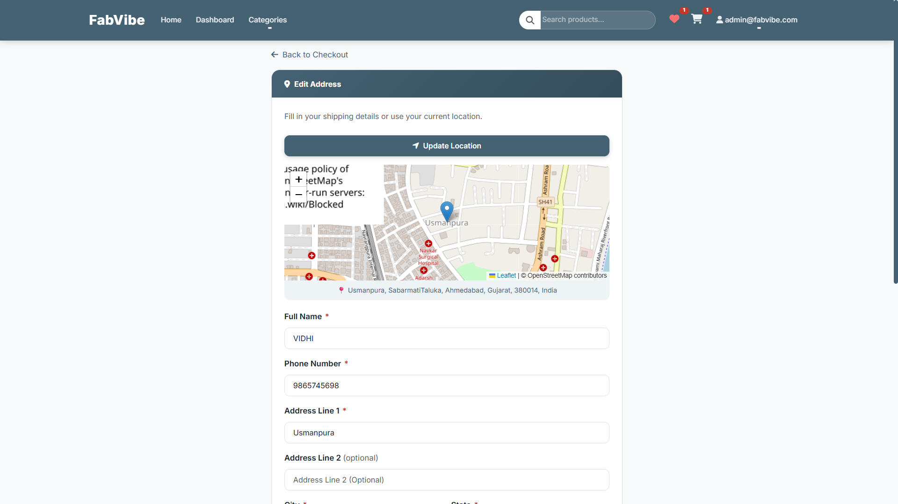


## 🔧 Configuration

Copy `.env.example` to `.env` and configure:

```env
SECRET_KEY=your-secret-key
DEBUG=True
EMAIL_HOST_USER=your-email
TWILIO_ACCOUNT_SID=your-twilio-sid
RAZORPAY_KEY_ID=your-razorpay-key
```

---

## 📦 Technology Stack

- Django 4.x
- SQLite3 (development)
- Celery (async tasks)
- Bootstrap (frontend)
- Pillow (image processing)

---

## 📝 License

Proprietary - FabVibe E-Commerce Platform

---

## 📞 Support

For detailed information, refer to the documentation files listed above.

**Version:** 1.0.0  
**Status:** Production Ready ✅


